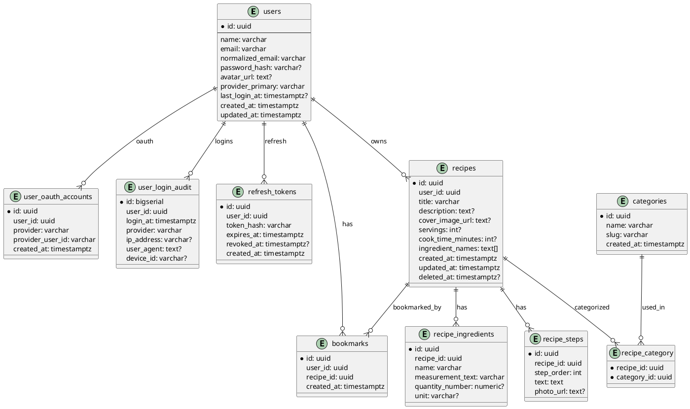

# Dokumen Teknis Proyek cookchela

Versi: 1.0  
Tanggal: 2025-11-25  
Status: Siap Implementasi

---

## 1. Ringkasan Proyek

| Item | Nilai |
|------|-------|
| Nama Proyek | cookchela |
| Platform | Mobile |
| Frontend | Flutter |
| Backend | Laravel (REST API) |
| Database | Supabase PostgreSQL |
| File Storage | Supabase Storage (bucket: `recipe-images`) |
| Deploy Backend | Render |
| Autentikasi | Email + Password & Google OAuth |
| Style Login UI | Mendukung pemilihan akun (recent account list) seperti tampilan “Pilih Akun” |

Tujuan: Menyediakan aplikasi berbagi resep dengan alur sederhana, mendukung multi-metode login, pembuatan resep lengkap (bahan & langkah), bookmark, feed timeline, dan pencarian dengan filter bahan & kategori.

---

## 2. Domain Fitur

1. Autentikasi (Registrasi, Login Email, Login Google, Refresh Token Opsional).
2. Pemilihan akun cepat (recent accounts) berdasarkan device.
3. CRUD Resep (Create, Read Detail, Update, Soft Delete).
4. Bookmark Resep.
5. Feed Timeline (pagination berbasis cursor).
6. Pencarian Resep (include & exclude bahan, kategori, kata kunci judul).
7. Kategori Resep (bisa dipilih multi per resep).

---

## 3. Standar Respons API

### 3.1 Format Success
```json
{
  "success": true,
  "data": { },
  "meta": { }
}
```

### 3.2 Format Error
```json
{
  "success": false,
  "error": {
    "code": "ERROR_CODE",
    "message": "Pesan ringkas",
    "details": {
      "field_name": ["Penjelasan kesalahan"]
    }
  }
}
```

### 3.3 Daftar Kode Error
| Code | Deskripsi |
|------|-----------|
| VALIDATION_ERROR | Data body/query tidak sesuai aturan |
| UNAUTHORIZED | Token hilang / tidak valid |
| FORBIDDEN | Akses tidak diizinkan (bukan pemilik) |
| NOT_FOUND | Data tidak ditemukan |
| EMAIL_EXISTS | Email sudah terdaftar |
| INVALID_CREDENTIALS | Email/password salah |
| OAUTH_INVALID | Token Google tidak valid |
| RECIPE_NOT_FOUND | Resep tidak ditemukan |
| FILE_TOO_BIG | Ukuran file melewati batas |
| UNSUPPORTED_MEDIA_TYPE | Format file tidak didukung |
| REFRESH_INVALID | Refresh token invalid |
| INTERNAL_ERROR | Kesalahan tak terduga |

---

## 4. Pagination (Cursor Strategy)

- Cursor = base64 encode: `created_at_iso::id`
- Parameter: `limit` (default 10, max 50), `cursor` (opsional).
- Respons `meta.next_cursor = null` bila tidak ada halaman berikut.

---

## 5. API Contract Lengkap

Base URL contoh: `https://api.cookchela.com/api/v1`

### 5.1 Auth

| Endpoint | Method | Path | Auth | Deskripsi |
|----------|--------|------|------|----------|
| Registrasi | POST | /auth/register | No | Membuat akun email/password |
| Login Email | POST | /auth/login | No | Login email/password |
| Login Google | POST | /auth/login/google | No | Login via Google ID Token |
| Me | GET | /auth/me | Yes | Profil user singkat |
| Logout | POST | /auth/logout | Yes | Logout satu sesi |
| Logout Semua | POST | /auth/logout-all | Yes | Revoke semua sesi (refresh) |
| Refresh Token | POST | /auth/refresh | Yes (refresh token) | Perpanjang access token |
| Daftar Akun (recent) | GET | /auth/recent | No (device_id diperlukan) | Mengambil akun yang pernah login di device |

#### POST /auth/register
Body:
```json
{
  "name": "string|min:2|max:100",
  "email": "string|email|max:150",
  "password": "string|min:8|regex:(?=.*[0-9])",
  "password_confirmation": "string|same:password"
}
```
Contoh:
```json
{
  "name": "Budi Santoso",
  "email": "budi@example.com",
  "password": "Rahasia123",
  "password_confirmation": "Rahasia123"
}
```
Respons (201):
```json
{
  "success": true,
  "data": {
    "user": {
      "id": "uuid",
      "name": "Budi Santoso",
      "email": "budi@example.com",
      "avatar_url": null,
      "provider_primary": "email",
      "last_login_at": null,
      "created_at": "2025-11-25T10:00:00Z"
    },
    "access_token": "jwt-token",
    "refresh_token": "refresh-token",
    "token_type": "Bearer",
    "expires_in": 1800
  },
  "meta": {}
}
```
Error (email sudah ada) → 409 / EMAIL_EXISTS.

#### POST /auth/login
Body:
```json
{
  "email": "string|email",
  "password": "string|min:8",
  "device_id": "string|optional"
}
```
Respons (200):
```json
{
  "success": true,
  "data": {
    "user": {
      "id": "uuid",
      "name": "Budi Santoso",
      "email": "budi@example.com",
      "avatar_url": null,
      "provider_primary": "email",
      "last_login_at": "2025-11-25T10:05:00Z"
    },
    "access_token": "jwt-token",
    "refresh_token": "refresh-token",
    "token_type": "Bearer",
    "expires_in": 1800
  },
  "meta": {}
}
```

#### POST /auth/login/google
Body:
```json
{
  "id_token": "string|required",
  "device_id": "string|optional"
}
```
Respons sama seperti login email (provider_primary = google).

#### GET /auth/me
Header: Authorization  
Respons:
```json
{
  "success": true,
  "data": {
    "id": "uuid",
    "name": "Budi",
    "email": "budi@example.com",
    "avatar_url": null,
    "provider_primary": "email",
    "last_login_at": "2025-11-25T10:05:00Z"
  },
  "meta": {}
}
```

#### POST /auth/logout
Respons:
```json
{
  "success": true,
  "data": { "message": "Logout berhasil" },
  "meta": {}
}
```

#### POST /auth/logout-all
Respons:
```json
{
  "success": true,
  "data": { "message": "Semua sesi direvoke" },
  "meta": {}
}
```

#### POST /auth/refresh
Body:
```json
{
  "refresh_token": "string|required"
}
```
Respons:
```json
{
  "success": true,
  "data": {
    "access_token": "new-jwt",
    "expires_in": 1800,
    "token_type": "Bearer"
  },
  "meta": {}
}
```

#### GET /auth/recent
Query Params:
- `device_id` (wajib)

Respons:
```json
{
  "success": true,
  "data": {
    "accounts": [
      {
        "email": "user1@gmail.com",
        "provider_primary": "google",
        "last_login_at": "2025-11-25T10:04:00Z"
      },
      {
        "email": "user2@gmail.com",
        "provider_primary": "email",
        "last_login_at": "2025-11-20T09:00:00Z"
      }
    ]
  },
  "meta": {
    "device_id": "DEVICE-1234"
  }
}
```

---

### 5.2 Recipes

| Endpoint | Method | Path | Auth | Deskripsi |
|----------|--------|------|------|----------|
| Feed | GET | /recipes | Optional | Resep terbaru (pagination) |
| Detail | GET | /recipes/{id} | Optional | Detail lengkap |
| Create | POST | /recipes | Yes | Buat resep |
| Update | PUT | /recipes/{id} | Yes (pemilik) | Ubah resep |
| Delete | DELETE | /recipes/{id} | Yes (pemilik) | Soft delete |
| Upload Cover (opsional) | POST | /recipes/{id}/cover | Yes (pemilik) | Upload gambar cover |
| List by User (opsional) | GET | /users/{id}/recipes | Optional | Daftar resep user |

#### GET /recipes
Query: `limit`, `cursor`
Respons:
```json
{
  "success": true,
  "data": [
    {
      "id": "uuid",
      "title": "Nasi Goreng",
      "cover_image_url": "https://storage.supabase/recipe-images/...",
      "user": {
        "id": "uuid",
        "name": "Budi"
      },
      "created_at": "2025-11-25T10:20:00Z",
      "bookmarked": false
    }
  ],
  "meta": {
    "next_cursor": "base64cursor",
    "limit": 10
  }
}
```

#### GET /recipes/{id}
Respons:
```json
{
  "success": true,
  "data": {
    "id": "uuid",
    "title": "Nasi Goreng Spesial",
    "description": "Resep enak",
    "cover_image_url": null,
    "servings": 2,
    "cook_time_minutes": 15,
    "user": {
      "id": "uuid",
      "name": "Budi"
    },
    "ingredients": [
      {
        "id": "uuid",
        "name": "nasi",
        "measurement_text": "2 piring",
        "quantity_number": null,
        "unit": null
      }
    ],
    "steps": [
      {
        "id": "uuid",
        "order": 1,
        "text": "Siapkan bahan",
        "photo_url": null
      }
    ],
    "categories": [
      { "id": "uuid", "name": "Makanan Utama", "slug": "makanan-utama" }
    ],
    "bookmarked": false,
    "created_at": "2025-11-25T10:21:00Z",
    "updated_at": "2025-11-25T10:22:00Z"
  },
  "meta": {}
}
```

#### POST /recipes
Body:
```json
{
  "title": "string|min:1|max:100",
  "description": "string|max:2000|optional",
  "cover_image_url": "string|url|optional",
  "servings": "int|positive|optional",
  "cook_time_minutes": "int|positive|optional",
  "category_ids": ["uuid","uuid"],
  "ingredients": [
    {
      "name": "string|lowercase|min:1|max:120",
      "measurement_text": "string|min:1|max:120",
      "quantity_number": "decimal|optional",
      "unit": "string|max:30|optional"
    }
  ],
  "steps": [
    {
      "text": "string|min:1",
      "photo_url": "string|url|optional"
    }
  ]
}
```
Respons (201):
```json
{
  "success": true,
  "data": { "id": "uuid", "title": "Nasi Goreng Spesial" },
  "meta": {}
}
```

Validasi:
- Minimal 1 ingredient & 1 step.
- Ingredient name lowercase (backend menormalkan).
- Tidak ada duplikasi ingredient name pada satu resep.

#### PUT /recipes/{id}
Body (partial, sama skema create, semua opsional):
```json
{
  "title": "Nasi Goreng Update",
  "ingredients": [
    { "name": "nasi", "measurement_text": "2 piring" }
  ]
}
```
Respons (200):
```json
{
  "success": true,
  "data": { "id": "uuid", "title": "Nasi Goreng Update" },
  "meta": {}
}
```

#### DELETE /recipes/{id}
Soft delete:
```json
{
  "success": true,
  "data": { "message": "Resep dihapus" },
  "meta": {}
}
```

#### POST /recipes/{id}/cover (multipart)
Form-data: file=image/jpeg/png (max 3MB)  
Respons:
```json
{
  "success": true,
  "data": {
    "cover_image_url": "https://storage.supabase/recipe-images/.../cover.jpg"
  },
  "meta": {}
}
```

### 5.3 Bookmark

| Endpoint | Method | Path | Auth | Deskripsi |
|----------|--------|------|------|----------|
| Tambah | POST | /recipes/{id}/bookmark | Yes | Bookmark resep |
| Hapus | DELETE | /recipes/{id}/bookmark | Yes | Hapus bookmark |
| List | GET | /bookmarks | Yes | Daftar bookmark user |

#### POST /recipes/{id}/bookmark
Respons:
```json
{
  "success": true,
  "data": { "message": "Bookmark ditambahkan" },
  "meta": {}
}
```

#### DELETE /recipes/{id}/bookmark
Respons:
```json
{
  "success": true,
  "data": { "message": "Bookmark dihapus" },
  "meta": {}
}
```

#### GET /bookmarks
Query: `limit`, `cursor`
Respons:
```json
{
  "success": true,
  "data": [
    {
      "recipe": {
        "id": "uuid",
        "title": "Nasi Goreng",
        "cover_image_url": "https://..."
      },
      "created_at": "2025-11-25T11:00:00Z"
    }
  ],
  "meta": {
    "next_cursor": null,
    "limit": 10
  }
}
```

### 5.4 Search

| Endpoint | Method | Path | Auth | Deskripsi |
|----------|--------|------|------|----------|
| Pencarian Resep | GET | /search/recipes | Optional | Filter bahan (include+exclude), kategori, keyword judul |

Query Params:
- `q` (string, optional) – wildcard pencarian di judul (case-insensitive)
- `include` (comma separated ingredients lowercase)
- `exclude` (comma separated ingredients lowercase)
- `category_ids` (comma separated UUID)
- `limit`, `cursor`

Respons:
```json
{
  "success": true,
  "data": [
    {
      "id": "uuid",
      "title": "Nasi Goreng Telur",
      "cover_image_url": null,
      "matched_ingredients": ["nasi","telur"]
    }
  ],
  "meta": {
    "next_cursor": null,
    "limit": 10,
    "filters": {
      "include": ["nasi","telur"],
      "exclude": ["gula"],
      "category_ids": ["cat1","cat2"],
      "q": "goreng"
    }
  }
}
```

### 5.5 Categories

| Endpoint | Method | Path | Auth | Deskripsi |
|----------|--------|------|------|----------|
| List Kategori | GET | /categories | No | Daftar kategori aktif |

Respons:
```json
{
  "success": true,
  "data": [
    { "id": "uuid", "name": "Makanan Utama", "slug": "makanan-utama" },
    { "id": "uuid", "name": "Minuman", "slug": "minuman" }
  ],
  "meta": {}
}
```

---

## 6. Database Schema (ERD)

### 6.1 Tabel Utama

#### users
| Kolom | Tipe | Ketentuan |
|-------|------|-----------|
| id | uuid | PK |
| name | varchar(100) | not null |
| email | varchar(150) | unique not null |
| normalized_email | varchar(150) | unique not null (lower) |
| password_hash | varchar(255) | nullable (null jika hanya OAuth) |
| avatar_url | text | nullable |
| provider_primary | varchar(30) | default 'email' |
| last_login_at | timestamptz | nullable |
| created_at | timestamptz | default now() |
| updated_at | timestamptz | default now() |

#### user_oauth_accounts
| Kolom | Tipe | Ketentuan |
|-------|------|-----------|
| id | uuid | PK |
| user_id | uuid | FK users.id cascade |
| provider | varchar(30) | 'google' |
| provider_user_id | varchar(190) | not null |
| created_at | timestamptz | default now() |
Unique: (provider, provider_user_id)

#### user_login_audit
| Kolom | Tipe |
|-------|------|
| id | bigserial |
| user_id | uuid (FK) |
| login_at | timestamptz default now() |
| provider | varchar(30) |
| ip_address | varchar(45) nullable |
| user_agent | text nullable |
| device_id | varchar(120) nullable |

#### refresh_tokens (opsional)
| Kolom | Tipe |
|-------|------|
| id | uuid |
| user_id | uuid (FK) |
| token_hash | varchar(255) |
| expires_at | timestamptz |
| revoked_at | timestamptz nullable |
| created_at | timestamptz default now() |

#### recipes
| Kolom | Tipe |
|-------|------|
| id | uuid |
| user_id | uuid FK |
| title | varchar(100) |
| description | text nullable |
| cover_image_url | text nullable |
| servings | int nullable |
| cook_time_minutes | int nullable |
| ingredient_names | text[] default '{}' |
| created_at | timestamptz |
| updated_at | timestamptz |
| deleted_at | timestamptz nullable |

#### recipe_ingredients
| Kolom | Tipe |
|-------|------|
| id | uuid |
| recipe_id | uuid FK |
| name | varchar(120) |
| measurement_text | varchar(120) |
| quantity_number | numeric(10,2) nullable |
| unit | varchar(30) nullable |

#### recipe_steps
| Kolom | Tipe |
|-------|------|
| id | uuid |
| recipe_id | uuid FK |
| step_order | int |
| text | text |
| photo_url | text nullable |

Unique: (recipe_id, step_order)

#### bookmarks
| Kolom | Tipe |
|-------|------|
| id | uuid |
| user_id | uuid FK |
| recipe_id | uuid FK |
| created_at | timestamptz |

Unique: (user_id, recipe_id)

#### categories
| Kolom | Tipe |
|-------|------|
| id | uuid |
| name | varchar(80) unique |
| slug | varchar(100) unique |
| created_at | timestamptz |

#### recipe_category
| Kolom | Tipe |
|-------|------|
| recipe_id | uuid FK |
| category_id | uuid FK |
Primary key: (recipe_id, category_id)

### 6.2 ER Diagram (PlantUML)


### 6.3 Index Rekomendasi
| Tabel | Index | Tujuan |
|-------|-------|--------|
| users | unique(email), unique(normalized_email), index(last_login_at) | Login cepat & daftar akun |
| user_login_audit | index(device_id), index(user_id, login_at DESC) | Daftar akun per device |
| recipes | index(created_at DESC), index(user_id, created_at) | Feed & filter user |
| recipe_ingredients | index(recipe_id), index(name) | Pencarian bahan |
| bookmarks | unique(user_id, recipe_id), index(user_id), index(recipe_id) | Operasi bookmark |
| recipe_steps | unique(recipe_id, step_order), index(recipe_id) | Ambil langkah cepat |
| categories | unique(name), unique(slug) | Lookup kategori |
| recipe_category | index(category_id), index(recipe_id) | Filter kategori |
| recipes(ingredient_names GIN) (opsional) | Search include/exclude lebih cepat |

---

## 7. Coding Guideline Laravel

### 7.1 Struktur Folder
```
app/
  Http/
    Controllers/
      Auth/
      Recipe/
      Bookmark/
      Search/
      Category/
    Requests/
    Middleware/
  Domain/
    Users/
      Models/
      Services/
      Repositories/
    Recipes/
      Models/
      Services/
      Repositories/
  Support/
    Exceptions/
    Helpers/
    Transformers/
config/
database/
  migrations/
routes/
  api.php
tests/
```

### 7.2 Naming Convention
| Item | Format | Contoh |
|------|--------|--------|
| Controller | PascalCase + Controller | RecipeController |
| Service | PascalCase + Service | AuthService |
| Repository | PascalCase + Repository | UserRepository |
| Request | PascalCase + Request | RegisterRequest |
| Model | Singular PascalCase | Recipe |
| Method Service | verb+Noun | createRecipe(), searchRecipes() |
| Route Group | `api/v1/...` | /api/v1/recipes |

### 7.3 Response Helper
Buat helper `ApiResponse`:
```php
class ApiResponse {
  public static function success($data = [], $meta = [], $code = 200) {
    return response()->json(['success' => true, 'data' => $data, 'meta' => $meta], $code);
  }
  public static function error($code, $message, $details = [], $http = 400) {
    return response()->json(['success' => false, 'error' => [
      'code' => $code, 'message' => $message, 'details' => $details
    ]], $http);
  }
}
```

### 7.4 Validasi
- Gunakan Form Request untuk setiap endpoint create/update.
- Password regex: `/^(?=.*[0-9]).{8,}$/`
- Ingredient name di-normalisasi lowercase di Service sebelum simpan.
- Minimal 1 bahan & 1 langkah saat create recipe.
- Cursor base64 decode validasi (return VALIDATION_ERROR jika tidak valid).

### 7.5 Migration Rules
- Gunakan UUID (extension `uuid-ossp` di Supabase).
- `timestamps()` untuk created/updated.
- Soft delete pada `recipes` dengan `deleted_at`.
- Foreign key dengan cascade delete untuk data turunan.

### 7.6 Model & Relasi
- Recipe: `user()`, `ingredients()`, `steps()`, `categories()`, `bookmarks()`.
- User: `recipes()`, `bookmarks()`, `oauthAccounts()`, `loginAudits()`, `refreshTokens()`.
- Category: `recipes()` via pivot.

### 7.7 Repository Pattern
Contoh:
```php
class RecipeRepository {
  public function findById($id) { /* query join ingredients & steps */ }
  public function create(array $data) { /* insert transaction */ }
  public function update(Recipe $recipe, array $data) { /* update */ }
  public function feed($cursor, $limit) { /* keyset pagination */ }
  public function search($filters) { /* compose query */ }
}
```

### 7.8 Error Handling
- DomainException → map ke `FORBIDDEN` / `NOT_FOUND`.
- ValidationException → `VALIDATION_ERROR`.
- Exception umum → `INTERNAL_ERROR` (log detail di file log, jangan bocor ke FE).

### 7.9 Komentar
- PHPDoc di semua Service public method: param & return.
- Hindari komentar berlebihan yang menjelaskan hal trivial.
- Berikan komentar pada algoritma pagination / pencarian.

### 7.10 Testing
| Jenis | Keterangan |
|-------|-----------|
| Unit Test | Service, transform, utility |
| Feature Test | Auth, Recipe CRUD, Search |
| Performance Test (opsional) | Query search dengan include/exclude banyak |

---

## 8. Deployment Checklist (Render + Supabase)

### 8.1 ENV (.env)
```
APP_NAME=cookchela
APP_ENV=production
APP_KEY=base64:GENERATE
APP_DEBUG=false
APP_URL=https://api.cookchela.com

DB_CONNECTION=pgsql
DB_HOST=<supabase_host>
DB_PORT=5432
DB_DATABASE=<supabase_db>
DB_USERNAME=<supabase_user>
DB_PASSWORD=<supabase_pass>

ACCESS_TOKEN_EXPIRES_SECONDS=1800
REFRESH_TOKEN_EXPIRES_DAYS=30
JWT_SECRET=<jika custom JWT>

GOOGLE_OAUTH_CLIENT_ID=<client-id>
GOOGLE_OAUTH_VERIFY_ENDPOINT=https://oauth2.googleapis.com/tokeninfo

SUPABASE_STORAGE_BUCKET=recipe-images
MAX_UPLOAD_MB=3
```

### 8.2 Langkah Deploy
1. Push kode ke GitHub.
2. Hubungkan repo ke Render (Web Service).
3. Build Command:
   ```
   composer install --no-dev --optimize-autoloader
   php artisan key:generate --force
   php artisan migrate --force
   php artisan config:cache
   php artisan route:cache
   php artisan view:cache
   ```
4. Start Command:
   ```
   php artisan serve --host 0.0.0.0 --port $PORT
   ```
5. Set domain & SSL (Render custom domain).
6. Health check endpoint: `/api/v1/health` (buat sederhana).

### 8.3 Storage Gambar
- FE upload langsung ke Supabase Storage (disarankan) → dapat URL → kirim pada create/update recipe.
- Jika via backend: gunakan service role key di server untuk upload; validasi ukuran & MIME.

### 8.4 Monitoring
- Aktifkan logging level `info`.
- Rotasi log otomatis (Render).
- Optional: Sentry untuk error FE + BE.

---

## 9. Branching Workflow

### 9.1 Branch
| Tipe | Format | Contoh |
|------|--------|--------|
| Main | main | main |
| Development | develop | develop |
| Fitur | feature/<kebab> | feature/login-google |
| Bugfix | bugfix/<kebab> | bugfix/recipe-404 |
| Hotfix | hotfix/<kebab> | hotfix/migration-error |
| Release (opsional) | release/vX.Y.Z | release/v1.0.0 |

### 9.2 Alur
1. Mulai dari `develop`.
2. Buat `feature/...`.
3. Buat PR ke `develop`.
4. Review (1 dev + Tech Lead).
5. Merge ke `develop`.
6. Release: PR `develop` → `main`.
7. Tag versi (`git tag v1.0.0`).

### 9.3 Commit Message (Conventional)
`type(scope): description`

| Type | Gunakan Saat |
|------|--------------|
| feat | Fitur baru |
| fix | Perbaikan bug |
| refactor | Perombakan kode tanpa fitur baru |
| docs | Dokumentasi |
| style | Perubahan format (tidak ubah logic) |
| test | Tambah/perbaikan test |
| chore | Maintenance |
| perf | Optimisasi |
| ci | Perubahan pipeline |

Contoh:
```
feat(auth): implementasi login google
fix(recipe): perbaiki validasi ingredient kosong
```

### 9.4 Pull Request Template
```
## Deskripsi
Ringkas perubahan.

## Issue Terkait
Closes #ISSUE

## Perubahan
- [ ] Endpoint baru /auth/login/google
- [ ] Migration user_oauth_accounts

## Cara Test
Langkah reproduksi / screenshot Postman.

## Migration
Ya/Tidak. Nama file.

## Catatan
Hal unik untuk reviewer.
```

### 9.5 Review Focus
- Kepatuhan guideline.
- Query performa (hindari N+1).
- Validasi & error mapping konsisten.
- Tidak ada sensitive key di response.

### 9.6 Tech Lead Role
- Final approval PR ke `main`.
- Menyetujui rancangan migration & ERD.
- Menangani konflik arsitektur.
- Audit keamanan autentikasi.

---

## 10. Security & Best Practices

| Area | Rekomendasi |
|------|-------------|
| Password | Hash bcrypt (cost aman) |
| Refresh Token | Simpan hash (SHA-256) bukan plaintext |
| Oauth | Verifikasi id_token ke endpoint Google (tokeninfo) |
| Rate Limit | 60 req/menit/user untuk auth endpoints |
| Input Sanitization | Gunakan Laravel validation + escape output |
| Soft Delete | Resep: filter `deleted_at IS NULL` |
| File Upload | Validasi ukuran & MIME (image/jpeg, image/png) |
| Logging | Jangan log password/refresh token |

---

## 11. Performance & Optimisasi Awal

| Target | Aksi |
|--------|------|
| Feed cepat | Index recipes(created_at DESC) |
| Search include/exclude | Pre-cache ingredient_names & index GIN jika perlu |
| Minim N+1 | Eager load relations di RecipeRepository |
| Pagination stabil | Keyset (created_at + id) vs offset |

---

## 12. Testing Checklist

| Test | Detail |
|------|--------|
| Auth Register | Valid & invalid (password mismatch) |
| Auth Login | Email salah, password salah |
| Google Login | Token valid & invalid |
| Create Recipe | Bahan & langkah minimal terpenuhi |
| Update Recipe | Ganti ingredients → lama terhapus |
| Delete Recipe | Soft delete benar |
| Feed Pagination | next_cursor berubah benar |
| Search Include/Exclude | Resep yang sesuai & tidak sesuai |
| Bookmark Add/Delete | Unique constraint bekerja |

---

## 13. Roadmap Ekstensi (Future)

| Fitur | Deskripsi |
|-------|-----------|
| Komentar | Tabel comments + pagination |
| Rating | Tabel ratings (1–5) agregasi ke resep |
| Notifikasi | Push notif (Expo / FCM) |
| Meal Planner | Jadwal resep mingguan |
| Advanced Search | Full-text (pg_trgm / tsvector) |

---

## 14. Checklist Implementasi Internal (Isi oleh Tim)

| Task | Status |
|------|--------|
| Buat semua migration dasar + tambahan auth tables | |
| Implement AuthService & Google verification | |
| Implement Refresh Token logic | |
| Implement RecipeService (create/update/delete) | |
| Implement SearchService (SQL composition) | |
| Implement BookmarkService | |
| Endpoint /auth/recent + device_id logic | |
| Postman Collection import & uji | |
| Tambah unit & feature tests | |
| Deploy ke staging (Render) | |
| Review Tech Lead | |
| Go-Live | |

---

## 15. Catatan Integrasi FE (Flutter)

| Elemen UI | Endpoint / Data | Catatan |
|-----------|-----------------|---------|
| Login | /auth/login | Kirim device_id (UUID) agar masuk audit |
| Login Google | /auth/login/google | Gunakan Google Sign-In SDK → id_token |
| Pilih Akun | /auth/recent?device_id=XYZ | Tampilkan email + provider_primary |
| Daftar | /auth/register | Validasi konfirmasi password lokal + server |
| Feed | /recipes | Gunakan next_cursor untuk infinite scroll |
| Detail Resep | /recipes/{id} | Bookmark status jika login |
| Buat Resep | /recipes | Upload cover lebih dulu → kirim URL |
| Bookmark Toggle | POST/DELETE /recipes/{id}/bookmark | Update local state segera (optimistic) |
| Search | /search/recipes | Build query string dari filter form |
| Kategori | /categories | Cache lokal untuk form create/update |

Device ID:
- Generate sekali (UUID) & simpan di secure storage.
- Kirim di setiap login agar audit & recent account sinkron.

---

## 16. Pseudocode Penting

### 16.1 Keyset Pagination (Repository)
```sql
SELECT id, title, created_at
FROM recipes
WHERE deleted_at IS NULL
  AND (
    :cursor_created_at IS NULL
    OR created_at < :cursor_created_at
    OR (created_at = :cursor_created_at AND id < :cursor_id)
  )
ORDER BY created_at DESC, id DESC
LIMIT :limit_plus_one;
```

### 16.2 Search Include/Exclude (Simplified)
```sql
WITH base AS (
  SELECT r.*
  FROM recipes r
  WHERE r.deleted_at IS NULL
    AND (:q IS NULL OR r.title ILIKE '%' || :q || '%')
)
SELECT b.*
FROM base b
WHERE (
  :include_count = 0 OR (
    SELECT COUNT(DISTINCT ri.name)
    FROM recipe_ingredients ri
    WHERE ri.recipe_id = b.id
      AND ri.name = ANY(:include_array)
  ) = :include_count
)
AND NOT EXISTS (
  SELECT 1
  FROM recipe_ingredients ri2
  WHERE ri2.recipe_id = b.id
    AND ri2.name = ANY(:exclude_array)
)
LIMIT :limit_plus_one;
```

---

## 17. Penutup

Dokumen ini merupakan baseline lengkap untuk memulai implementasi backend dan frontend cookchela dengan UI autentikasi terbaru (pilih akun + integrasi Google). Semua tim (FE & BE) diharapkan mengikuti spesifikasi ini secara ketat agar konsistensi terjaga dan risiko revisi berulang berkurang.

Jika memerlukan:
- Contoh migration penuh
- Template Form Request Laravel
- Unit test contoh

Silakan minta di komunikasi berikut.

Selamat mengembangkan!
