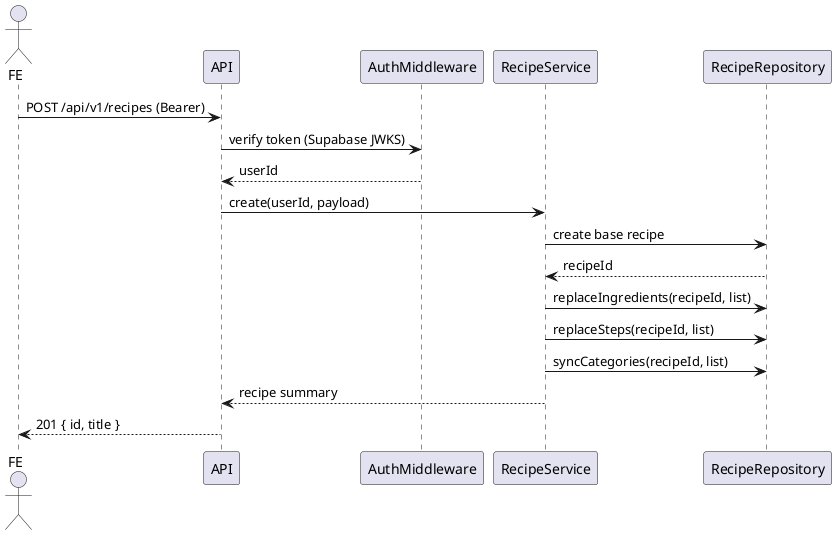

# CookChela — Backend Technical Document (Laravel + Supabase + Render)

Versi: 1.0  
Tanggal: 2025-11-26  
Audience: Tim Backend (3 orang) + Backend Lead  
Tujuan: Dokumen teknis siap eksekusi untuk implementasi API CookChela.

---

## Ringkasan Teknis

| Item | Nilai |
|------|-------|
| Bahasa | PHP (Laravel 10/11) |
| Database | Supabase PostgreSQL |
| Auth | Supabase Auth (Email/Password + Google OAuth) |
| Storage | Supabase Storage (bucket: `recipe-images`) |
| Deployment | Render (Web Service) |
| Aplikasi | CookChela |
| Jumlah Dev Backend | 3 orang + Backend Lead (reviewer/standar teknis) |

---

## Fitur Wajib

- Login & Registrasi User (Supabase Auth + Google)
- Homepage dan Feed Timeline (pagination)
- CRUD Resep + Upload Gambar
- Bookmark Resep
- Pencarian Resep + Filter Kategori/Bahan
- Profile Page (lihat & edit)

---

## Bagian 1 — API Contract (by Domain Ownership)

Base URL: `https://api.cookchela.com/api/v1` (contoh, sesuaikan Render)  
Respons standar:

- Success:
```json
{
  "success": true,
  "data": {},
  "meta": {}
}
```
- Error:
```json
{
  "success": false,
  "error": {
    "code": "ERROR_CODE",
    "message": "Pesan ringkas",
    "details": {
      "field": ["penjelasan"]
    }
  }
}
```

Pagination: cursor base64 dari `created_at::id`  
Upload file: multipart form-data field `file` (image/jpeg|image/png, max 3MB).  
Auth: Bearer token (access token dari Supabase Auth).

### Developer A — Auth + Profile

#### POST /auth/register
- Method: POST
- Auth: Tidak
- Body:
```json
{
  "name": "string|min:2|max:100",
  "email": "string|email|max:150",
  "password": "string|min:8|regex:(?=.*[0-9])",
  "password_confirmation": "string|same:password"
}
```
- Validasi: name, email unik (normalized lower-case), password regex
- Respons (201):
```json
{
  "success": true,
  "data": {
    "user": { "id": "uuid", "name": "Budi", "email": "budi@example.com", "provider_primary": "email", "avatar_url": null },
    "access_token": "jwt",
    "refresh_token": "rt",
    "token_type": "Bearer",
    "expires_in": 1800
  },
  "meta": {}
}
```
- Error: 409 EMAIL_EXISTS, 422 VALIDATION_ERROR

Catatan: Backend mengarahkan Registrasi via Supabase Admin API (opsi 1) atau FE langsung ke Supabase Auth (opsi 2). Jika FE langsung Supabase, endpoint ini boleh skip (disediakan untuk fallback).

#### POST /auth/login
- Method: POST
- Auth: Tidak
- Body:
```json
{
  "email": "string|email",
  "password": "string|min:8",
  "device_id": "string|optional"
}
```
- Validasi: email/password, audit login (device_id)
- Respons (200): sama seperti register (dengan `provider_primary`)
- Error: 401 INVALID_CREDENTIALS

Jika FE login langsung ke Supabase, endpoint ini fungsi proxy (opsional). Minimal sediakan `/auth/me`.

#### POST /auth/login/google
- Method: POST
- Auth: Tidak
- Body:
```json
{
  "id_token": "string|required",
  "device_id": "string|optional"
}
```
- Validasi: verifikasi id_token pada Google tokeninfo; map ke user + link user_oauth_accounts
- Respons (200): sama login email (provider_primary=google)
- Error: 401 OAUTH_INVALID

#### GET /auth/me
- Method: GET
- Auth: Ya
- Respons (200):
```json
{
  "success": true,
  "data": {
    "id": "uuid", "name": "User", "email": "user@example.com",
    "username": "userpyto6", "avatar_url": null,
    "provider_primary": "email", "last_login_at": "2025-11-26T02:00:00Z",
    "preferred_language": "id"
  },
  "meta": {}
}
```

#### POST /auth/logout
- Method: POST
- Auth: Ya
- Respons:
```json
{ "success": true, "data": { "message": "Logout berhasil" }, "meta": {} }
```

#### POST /auth/logout-all
- Method: POST
- Auth: Ya
- Respons:
```json
{ "success": true, "data": { "message": "Semua sesi direvoke" }, "meta": {} }
```

#### POST /auth/refresh
- Method: POST
- Auth: Ya (mengirim refresh token)
- Body:
```json
{ "refresh_token": "string|required" }
```
- Respons:
```json
{ "success": true, "data": { "access_token": "new-jwt", "expires_in": 1800 }, "meta": {} }
```
- Error: 401 REFRESH_INVALID

#### PATCH /profile
- Method: PATCH
- Path: /profile
- Auth: Ya
- Body (opsional):
```json
{
  "name": "string|min:2|max:100",
  "username": "string|regex:^[a-z0-9_]{3,50}$",
  "avatar_url": "string|url",
  "preferred_language": "string|in:id,en"
}
```
- Validasi: username unik (lowercase enforced), URL valid
- Respons (200):
```json
{
  "success": true,
  "data": {
    "id": "uuid",
    "name": "User PyTorch",
    "username": "userpytorch6",
    "avatar_url": null,
    "preferred_language": "id"
  },
  "meta": {}
}
```
- Error: 409 USERNAME_TAKEN

#### GET /users/{username}
- Method: GET
- Auth: Tidak
- Respons:
```json
{
  "success": true,
  "data": {
    "id": "uuid",
    "username": "userpytorch6",
    "name": "User PyTorch",
    "avatar_url": null,
    "recipes_count": 12,
    "likes_received": 5300
  },
  "meta": {}
}
```
- Error: 404 NOT_FOUND

---

### Developer B — Recipe CRUD + Feed + Homepage

#### GET /home
- Method: GET
- Auth: Optional (recent_searches hanya tampil jika login)
- Query: `limit_featured=3`, `limit_timeline=5`
- Respons:
```json
{
  "success": true,
  "data": {
    "greeting": { "name": "User", "message": "Halo, User 👋" },
    "featured_recipes": [
      { "id": "uuid", "title": "Chicken Katsu ala Hokben", "cover_image_url": "https://...", "likes_count": 2500 }
    ],
    "timeline_preview": [
      {
        "id": "uuid", "title": "Ayam Goreng Mentega",
        "cover_image_url": "https://...",
        "short_description": "Lorem ipsum...",
        "user": { "id": "uuid", "name": "User 1", "username": "user1" },
        "likes_count": 2500, "userLiked": false, "bookmarked": false,
        "cook_time_minutes": 60, "servings": 3, "created_at": "..."
      }
    ],
    "recent_searches": [
      { "id": "uuid", "query_text": "Ayam Goreng Mentega", "executed_at": "2025-11-26T02:10:00Z" }
    ]
  },
  "meta": { "limit_featured": 3, "limit_timeline": 5 }
}
```

#### GET /recipes (Feed Timeline)
- Method: GET
- Auth: Optional
- Query: `limit` (default 10, max 50), `cursor` (base64)
- Respons:
```json
{
  "success": true,
  "data": [
    {
      "id": "uuid", "title": "Chicken Katsu ala Hokben",
      "cover_image_url": "https://...",
      "short_description": "Lorem...",
      "user": { "id": "uuid", "name": "User 1", "username": "user1" },
      "likes_count": 2500, "userLiked": false, "bookmarked": false,
      "cook_time_minutes": 60, "servings": 3,
      "created_at": "2025-11-26T01:55:00Z"
    }
  ],
  "meta": { "next_cursor": "BASE64", "limit": 10 }
}
```

#### GET /recipes/featured
- Method: GET
- Auth: Tidak
- Query: `limit` (default 5)
- Respons:
```json
{
  "success": true,
  "data": [
    { "id": "uuid", "title": "Chicken Katsu ala Hokben", "cover_image_url": "https://...", "likes_count": 2500 }
  ],
  "meta": { "limit": 5 }
}
```

#### GET /recipes/{id}
- Method: GET
- Auth: Optional
- Respons:
```json
{
  "success": true,
  "data": {
    "id": "uuid", "title": "Chicken Katsu ala Hokben",
    "description": "Lorem ipsum dolor sit amet...",
    "cover_image_url": "https://...",
    "servings": 3, "cook_time_minutes": 60,
    "likes_count": 2500, "userLiked": true, "bookmarked": false,
    "share_url": "https://cookchela.com/recipe/uuid",
    "user": { "id": "uuid", "name": "User 1", "username": "user1" },
    "ingredients": [
      { "id": "uuid", "name": "ayam", "measurement_text": "300 gram", "quantity_number": 300, "unit": "gram" }
    ],
    "steps": [
      { "id": "uuid", "order": 1, "text": "Siapkan bahan", "photo_url": null }
    ],
    "categories": [ { "id": "uuid", "name": "Makanan Utama", "slug": "makanan-utama" } ],
    "created_at": "...", "updated_at": "..."
  },
  "meta": {}
}
```

#### POST /recipes (Create)
- Method: POST
- Auth: Ya
- Body:
```json
{
  "title": "string|min:1|max:100",
  "description": "string|max:2000|optional",
  "cover_image_url": "string|url|optional",
  "servings": "int|positive|optional",
  "cook_time_minutes": "int|positive|optional",
  "category_ids": ["uuid","uuid"],
  "ingredients": [
    { "name": "string|lowercase|min:1|max:120", "measurement_text": "string|min:1|max:120", "quantity_number": "decimal|optional", "unit": "string|max:30|optional" }
  ],
  "steps": [
    { "text": "string|min:1", "photo_url": "string|url|optional" }
  ]
}
```
- Validasi: minimal 1 ingredient & step; ingredient `name` lowercase; category_ids valid
- Respons (201):
```json
{ "success": true, "data": { "id": "uuid", "title": "Nasi Goreng Spesial" }, "meta": {} }
```

#### PUT /recipes/{id} (Update)
- Method: PUT
- Auth: Ya (pemilik)
- Body: partial (sama schema create, semua opsional)
- Respons (200):
```json
{ "success": true, "data": { "id": "uuid", "title": "Nasi Goreng Update" }, "meta": {} }
```

#### DELETE /recipes/{id} (Soft Delete)
- Method: DELETE
- Auth: Ya (pemilik)
- Respons:
```json
{ "success": true, "data": { "message": "Resep dihapus" }, "meta": {} }
```

#### POST /recipes/{id}/cover (Upload Cover — Opsional)
- Method: POST
- Auth: Ya (pemilik)
- Upload: multipart/form-data `file` (image/jpeg|png; max 3MB)
- Respons:
```json
{ "success": true, "data": { "cover_image_url": "https://storage.supabase/recipe-images/.../cover.jpg" }, "meta": {} }
```
- Error: 400 FILE_TOO_BIG, 415 UNSUPPORTED_MEDIA_TYPE

#### POST /recipes/{id}/like
- Method: POST
- Auth: Ya
- Respons:
```json
{ "success": true, "data": { "message": "Resep di-like", "likes_count": 2501, "userLiked": true }, "meta": {} }
```
- Error: 409 ALREADY_LIKED (optional)

#### DELETE /recipes/{id}/like
- Method: DELETE
- Auth: Ya
- Respons:
```json
{ "success": true, "data": { "message": "Like dihapus", "likes_count": 2500, "userLiked": false }, "meta": {} }
```

---

### Developer C — Bookmark + Search + Profile Page

#### POST /recipes/{id}/bookmark
- Method: POST
- Auth: Ya
- Respons:
```json
{ "success": true, "data": { "message": "Bookmark ditambahkan" }, "meta": {} }
```

#### DELETE /recipes/{id}/bookmark
- Method: DELETE
- Auth: Ya
- Respons:
```json
{ "success": true, "data": { "message": "Bookmark dihapus" }, "meta": {} }
```

#### GET /bookmarks
- Method: GET
- Auth: Ya
- Query: `limit`, `cursor`
- Respons:
```json
{
  "success": true,
  "data": [
    { "recipe": { "id": "uuid", "title": "Nasi Goreng", "cover_image_url": "https://..." }, "created_at": "2025-11-26T02:20:00Z" }
  ],
  "meta": { "next_cursor": null, "limit": 10 }
}
```

#### GET /ingredients/groups
- Method: GET
- Auth: Tidak
- Respons:
```json
{
  "success": true,
  "data": [
    { "id": "uuid", "name": "Protein", "slug": "protein", "items": ["ayam","sapi","telur","ikan"] },
    { "id": "uuid", "name": "Bumbu & Rempah", "slug": "bumbu-rempah", "items": ["cabe","kayu manis","bawang putih","jahe"] }
  ],
  "meta": {}
}
```

#### GET /search/recipes
- Method: GET
- Auth: Optional
- Query:
  - `q` (string, optional) — cari di title (ILIKE)
  - `include` (comma lower) — semua harus ada
  - `exclude` (comma lower) — tidak boleh ada
  - `category_ids` (comma UUID)
  - `limit`, `cursor`
- Respons:
```json
{
  "success": true,
  "data": [
    { "id": "uuid", "title": "Ayam Goreng Telur", "cover_image_url": "https://...", "matched_ingredients": ["ayam","telur"], "likes_count": 1700 }
  ],
  "meta": {
    "next_cursor": null, "limit": 10,
    "filters": { "include": ["ayam","telur"], "exclude": ["gula"], "category_ids": ["cat1"], "q": "goreng" }
  }
}
```

#### GET /search/suggest
- Method: GET
- Auth: Tidak
- Query: `term` (min 2 chars), `limit` (default 8)
- Respons:
```json
{
  "success": true,
  "data": {
    "recipes": [ { "id": "uuid", "title": "Ayam Goreng Mentega" } ],
    "ingredients": ["ayam","mentega","bawang putih"],
    "users": [ { "id": "uuid", "username": "user1", "name": "User 1" } ]
  },
  "meta": { "limit": 8, "term": "aya" }
}
```

#### GET /search/history
- Method: GET
- Auth: Ya
- Query: `limit` (default 10)
- Respons:
```json
{
  "success": true,
  "data": [
    { "id": "uuid", "query_text": "Ayam Goreng Mentega", "executed_at": "2025-11-26T02:10:00Z" }
  ],
  "meta": { "limit": 10 }
}
```

#### DELETE /search/history
- Method: DELETE
- Auth: Ya
- Respons:
```json
{ "success": true, "data": { "deleted": true }, "meta": {} }
```

---

## Bagian 2 — Database Architecture (ERD)

### Tabel & Kolom (Supabase PostgreSQL)

1) users  
- id UUID PK  
- name VARCHAR(100) NOT NULL  
- email VARCHAR(150) UNIQUE NOT NULL  
- normalized_email VARCHAR(150) UNIQUE NOT NULL (lowercase)  
- password_hash VARCHAR(255) NULL (null jika hanya OAuth)  
- avatar_url TEXT NULL  
- username VARCHAR(50) UNIQUE NULL (lowercase, alnum+underscore)  
- provider_primary VARCHAR(30) NOT NULL DEFAULT 'email'  
- preferred_language VARCHAR(10) NOT NULL DEFAULT 'id'  
- last_login_at TIMESTAMPTZ NULL  
- created_at TIMESTAMPTZ DEFAULT now()  
- updated_at TIMESTAMPTZ DEFAULT now()  
Index: unique(email), unique(normalized_email), unique(username), index(last_login_at)

2) user_oauth_accounts  
- id UUID PK  
- user_id UUID FK → users.id (cascade)  
- provider VARCHAR(30) NOT NULL ('google')  
- provider_user_id VARCHAR(190) NOT NULL  
- created_at TIMESTAMPTZ DEFAULT now()  
Constraints: unique(provider, provider_user_id), index(user_id)

3) refresh_tokens (opsional bila pakai refresh manual)  
- id UUID PK  
- user_id UUID FK → users.id  
- token_hash VARCHAR(255) NOT NULL  
- expires_at TIMESTAMPTZ NOT NULL  
- revoked_at TIMESTAMPTZ NULL  
- created_at TIMESTAMPTZ DEFAULT now()  
Index: (user_id), (expires_at), unique(token_hash) (opsional)

4) user_login_audit  
- id BIGSERIAL PK  
- user_id UUID FK → users.id  
- login_at TIMESTAMPTZ DEFAULT now()  
- provider VARCHAR(30) NOT NULL  
- ip_address VARCHAR(45) NULL  
- user_agent TEXT NULL  
- device_id VARCHAR(120) NULL  
Index: (user_id, login_at DESC), (device_id)

5) recipes  
- id UUID PK  
- user_id UUID FK → users.id (cascade)  
- title VARCHAR(100) NOT NULL  
- description TEXT NULL  
- cover_image_url TEXT NULL  
- servings INT NULL  
- cook_time_minutes INT NULL  
- ingredient_names TEXT[] DEFAULT '{}'  
- likes_count INT DEFAULT 0 (denormalisasi opsional)  
- created_at TIMESTAMPTZ DEFAULT now()  
- updated_at TIMESTAMPTZ DEFAULT now()  
- deleted_at TIMESTAMPTZ NULL  
Index: (created_at DESC), (user_id, created_at), (likes_count DESC, created_at DESC) opsional

6) recipe_ingredients  
- id UUID PK  
- recipe_id UUID FK → recipes.id (cascade)  
- name VARCHAR(120) NOT NULL (lowercase canonical)  
- measurement_text VARCHAR(120) NOT NULL  
- quantity_number NUMERIC(10,2) NULL  
- unit VARCHAR(30) NULL  
Constraints: index(recipe_id), index(name)

7) recipe_steps  
- id UUID PK  
- recipe_id UUID FK → recipes.id (cascade)  
- step_order INT NOT NULL  
- text TEXT NOT NULL  
- photo_url TEXT NULL  
Constraints: unique(recipe_id, step_order), index(recipe_id)

8) bookmarks  
- id UUID PK  
- user_id UUID FK → users.id (cascade)  
- recipe_id UUID FK → recipes.id (cascade)  
- created_at TIMESTAMPTZ DEFAULT now()  
Constraints: unique(user_id, recipe_id), index(user_id), index(recipe_id)

9) recipe_likes  
- id UUID PK  
- recipe_id UUID FK → recipes.id (cascade)  
- user_id UUID FK → users.id (cascade)  
- created_at TIMESTAMPTZ DEFAULT now()  
Constraints: unique(recipe_id, user_id), index(recipe_id), index(user_id)

10) categories  
- id UUID PK  
- name VARCHAR(80) UNIQUE NOT NULL  
- slug VARCHAR(100) UNIQUE NOT NULL  
- created_at TIMESTAMPTZ DEFAULT now()  
Index: unique(name), unique(slug)

11) recipe_category (pivot)  
- recipe_id UUID FK → recipes.id (cascade)  
- category_id UUID FK → categories.id (cascade)  
PK: (recipe_id, category_id)  
Index: (recipe_id), (category_id)

12) ingredient_groups  
- id UUID PK  
- name VARCHAR(80) UNIQUE NOT NULL  
- slug VARCHAR(100) UNIQUE NOT NULL  
- display_order INT DEFAULT 0  
- created_at TIMESTAMPTZ DEFAULT now()

13) ingredient_group_members  
- id UUID PK  
- ingredient_group_id UUID FK → ingredient_groups.id (cascade)  
- ingredient_name VARCHAR(120) NOT NULL (lowercase)  
- created_at TIMESTAMPTZ DEFAULT now()  
Constraints: unique(ingredient_group_id, ingredient_name), index(ingredient_name)

Relasi utama ditunjukkan berikut:

```plantuml
@startuml
entity users {
  *id: uuid
  --
  name: varchar
  email: varchar
  normalized_email: varchar
  password_hash: varchar?
  avatar_url: text?
  username: varchar?
  provider_primary: varchar
  preferred_language: varchar
  last_login_at: timestamptz?
  created_at: timestamptz
  updated_at: timestamptz
}

entity user_oauth_accounts { *id: uuid, user_id: uuid, provider: varchar, provider_user_id: varchar, created_at: timestamptz }
entity refresh_tokens { *id: uuid, user_id: uuid, token_hash: varchar, expires_at: timestamptz, revoked_at: timestamptz?, created_at: timestamptz }
entity user_login_audit { *id: bigserial, user_id: uuid, login_at: timestamptz, provider: varchar, ip_address: varchar?, user_agent: text?, device_id: varchar? }

entity recipes {
  *id: uuid, user_id: uuid, title: varchar, description: text?, cover_image_url: text?, servings: int?, cook_time_minutes: int?,
  ingredient_names: text[], likes_count: int, created_at: timestamptz, updated_at: timestamptz, deleted_at: timestamptz?
}
entity recipe_ingredients { *id: uuid, recipe_id: uuid, name: varchar, measurement_text: varchar, quantity_number: numeric?, unit: varchar? }
entity recipe_steps { *id: uuid, recipe_id: uuid, step_order: int, text: text, photo_url: text? }
entity bookmarks { *id: uuid, user_id: uuid, recipe_id: uuid, created_at: timestamptz }
entity recipe_likes { *id: uuid, recipe_id: uuid, user_id: uuid, created_at: timestamptz }
entity categories { *id: uuid, name: varchar, slug: varchar, created_at: timestamptz }
entity recipe_category { *recipe_id: uuid, *category_id: uuid }
entity ingredient_groups { *id: uuid, name: varchar, slug: varchar, display_order: int, created_at: timestamptz }
entity ingredient_group_members { *id: uuid, ingredient_group_id: uuid, ingredient_name: varchar, created_at: timestamptz }

users ||--o{ recipes : owns
recipes ||--o{ recipe_ingredients : has
recipes ||--o{ recipe_steps : has
users ||--o{ bookmarks : has
recipes ||--o{ bookmarks : bookmarked_by
recipes ||--o{ recipe_category : categorized
categories ||--o{ recipe_category : has
users ||--o{ user_oauth_accounts : oauth
users ||--o{ refresh_tokens : refresh
users ||--o{ user_login_audit : logins
recipes ||--o{ recipe_likes : liked_by
ingredient_groups ||--o{ ingredient_group_members : includes
@enduml
```

---

## Bagian 3 — Coding Guidelines Laravel

### Folder Structure
```
app/
  Http/
    Controllers/
      Auth/
      Profile/
      Recipe/
      Bookmark/
      Search/
      Home/
    Requests/
    Middleware/
  Domain/
    Users/
      Models/User.php
      Services/AuthService.php
      Services/ProfileService.php
      Repositories/UserRepository.php
      Repositories/OAuthRepository.php
      Repositories/RefreshTokenRepository.php
      Repositories/LoginAuditRepository.php
    Recipes/
      Models/Recipe.php
      Models/RecipeIngredient.php
      Models/RecipeStep.php
      Models/Bookmark.php
      Models/RecipeLike.php
      Models/Category.php
      Models/IngredientGroup.php
      Models/IngredientGroupMember.php
      Services/RecipeService.php
      Services/FeedService.php
      Services/HomeService.php
      Services/LikeService.php
      Repositories/RecipeRepository.php
      Repositories/BookmarkRepository.php
      Repositories/LikeRepository.php
      Repositories/CategoryRepository.php
      Repositories/IngredientGroupRepository.php
    Search/
      Services/SearchService.php
      Repositories/SearchRepository.php
  Support/
    Exceptions/DomainException.php
    Helpers/ApiResponse.php
    Traits/NormalizesEmail.php
routes/
  api.php
database/
  migrations/
tests/
```

### Naming Convention
- Controller: PascalCase + `Controller` (RecipeController)
- Service: PascalCase + `Service` (AuthService)
- Repository: PascalCase + `Repository`
- Model: Singular PascalCase (Recipe)
- Request: PascalCase + `Request` (CreateRecipeRequest)
- Method Service: `verbNoun` (createRecipe, searchRecipes)
- Route prefix: `/api/v1/...`

### JSON Response Standard (Wajib)
Gunakan helper:
```php
class ApiResponse {
  public static function success($data = [], $meta = [], int $code = 200) {
    return response()->json(['success' => true, 'data' => $data, 'meta' => $meta], $code);
  }
  public static function error(string $code, string $message, array $details = [], int $http = 400) {
    return response()->json(['success' => false, 'error' => ['code' => $code, 'message' => $message, 'details' => $details]], $http);
  }
}
```

### Exception Handling
- ValidationException → `VALIDATION_ERROR` (422)
- DomainException (business rule) → `FORBIDDEN` (403) atau `NOT_FOUND` (404)
- AuthenticationException → `UNAUTHORIZED` (401)
- Throwable umum → `INTERNAL_ERROR` (500, log detail)
- Map di `app/Exceptions/Handler.php`

### Migration Rules
- UUID sebagai PK (`uuid_generate_v4()`)
- timestamps (`created_at`, `updated_at`)
- Soft delete pada `recipes` (kolom `deleted_at`)
- FK cascade untuk turunan (ingredients, steps, likes, bookmarks)
- Index untuk feed & search sesuai daftar ERD

### Commenting Rules
- PHPDoc di semua Service public method: deskripsi, parameter, return, throws
- Komentar hanya untuk logika non-trivial (pagination keyset, search include/exclude)
- Hindari komentar trivial

### Authorization & Middleware
- Middleware `auth:sanctum` atau custom JWT guard verifikasi Supabase token (JWKS)
- Gate/Policy:
  - RecipePolicy: update/delete hanya pemilik
  - BookmarkPolicy: hanya pemilik bookmark (opsional)
- Verification token: JWKS `https://<project>.supabase.co/auth/v1/jwks`

---

## Bagian 4 — Technical Workflow untuk 3 Dev

### Branching Rules
- main → production
- develop → integrasi
- feature/** → per fitur
- bugfix/**, hotfix/**, release/vX.Y.Z (opsional)

### Role Backend Lead
- PR approval wajib sebelum merge ke develop/main
- Menetapkan standar code (lint, style, response format)
- Review arsitektur & ERD saat ada perubahan
- Gatekeeper security (auth, secrets)

### Commit Message Rules (Conventional Commits)
`type(scope): description`
- feat, fix, refactor, docs, style, test, chore, perf, ci
Contoh:
```
feat(auth): implement google login ID token verification
fix(recipe): correct ingredient normalization to lowercase
```

### Code Review Standard
- Cek guideline kepatuhan (folder, naming)
- Response JSON konsisten
- Validasi lengkap (Request untuk create/update)
- Query efisien (hindari N+1)
- Unit/feature tests untuk endpoint kritis

### Testing API dengan Postman
- Sediakan Postman Collection (Auth, Home, Feed, Recipe CRUD, Bookmark, Search, Profile)
- Variabel: baseUrl, accessToken, refreshToken
- Jalankan smoke test tiap PR

### Versioning Database Migration
- Nama waktu: `YYYY_MM_DD_HHMMSS_create_table_name.php`
- Perubahan skema → migration terpisah + seeder jika perlu
- Migrate pada staging sebelum prod
- Gunakan changelog internal (README_db.md) ringkas

---

## Bagian 5 — Supabase + Render Deployment Guide

### Setup Environment (.env)
```
APP_NAME=CookChela
APP_ENV=production
APP_KEY=base64:GENERATE
APP_DEBUG=false
APP_URL=https://api.cookchela.com

DB_CONNECTION=pgsql
DB_HOST=<supabase_host>
DB_PORT=5432
DB_DATABASE=<supabase_db>
DB_USERNAME=<supabase_user>
DB_PASSWORD=<supabase_pass>

# Auth
SUPABASE_URL=https://<PROJECT>.supabase.co
SUPABASE_ANON_KEY=<anon>
SUPABASE_SERVICE_ROLE_KEY=<service-role-key>
SUPABASE_JWT_ISSUER=https://<PROJECT>.supabase.co/auth/v1
GOOGLE_OAUTH_CLIENT_ID=<client-id>
GOOGLE_OAUTH_VERIFY_ENDPOINT=https://oauth2.googleapis.com/tokeninfo

# Tokens
ACCESS_TOKEN_EXPIRES_SECONDS=1800
REFRESH_TOKEN_EXPIRES_DAYS=30

# Storage
SUPABASE_STORAGE_BUCKET=recipe-images
MAX_UPLOAD_MB=3

# CORS
ALLOWED_ORIGINS=https://cookchela.app,https://staging.cookchela.app
```

### Supabase Storage untuk Gambar
- Buat bucket `recipe-images` (public atau signed URL)
- FE upload langsung disarankan (hemat beban server), backend menerima URL
- Jika via backend: gunakan service role key; validasi MIME dan ukuran

### Migration Command
```bash
php artisan migrate --force
php artisan db:seed --class=CategorySeeder
php artisan db:seed --class=IngredientGroupSeeder
```

### Render Deploy Pipeline
- Hubungkan repo
- Build Command:
```
composer install --no-dev --optimize-autoloader
php artisan key:generate --force
php artisan migrate --force
php artisan config:cache
php artisan route:cache
php artisan view:cache
```
- Start Command:
```
php artisan serve --host 0.0.0.0 --port $PORT
```
- Health Check: `/api/v1/health` (buat sederhana, return `ok`)

### Allowed CORS
- Middleware CORS: hanya domain FE (ALLOWED_ORIGINS)
- Methods: GET, POST, PUT, DELETE, OPTIONS
- Headers: Authorization, Content-Type

### Backup Plan
- Supabase: backup otomatis harian (default project)
- Export DB snapshot tiap minggu (manual/CI)
- Simpan Postman Export & Migration versioning di repo
- Recovery: restore Supabase backup → run migrations delta → smoke test

---

## Contoh Kode Minimal per Domain

### AuthService (verifikasi Google ID token — simplified)
```php
public function loginGoogle(string $idToken, ?string $deviceId, Request $req): array {
    $payload = $this->googleVerifier->verify($idToken); // panggil tokeninfo
    $email = $payload['email'];
    $normalized = strtolower($email);

    $user = $this->userRepo->findByNormalizedEmail($normalized) ?? $this->userRepo->create([
        'name' => $payload['name'] ?? 'Pengguna',
        'email' => $email,
        'normalized_email' => $normalized,
        'provider_primary' => 'google',
        'avatar_url' => $payload['picture'] ?? null,
    ]);

    $this->oauthRepo->ensureLinked($user->id, 'google', $payload['sub']);
    $this->loginAuditRepo->record($user->id, 'google', $deviceId, $req->ip(), $req->userAgent());

    $tokens = $this->tokenService->issueTokens($user->id);
    return ['user' => $user, 'access_token' => $tokens->access, 'refresh_token' => $tokens->refresh, 'expires_in' => $tokens->ttl];
}
```

### RecipeService (create — normalized ingredient names)
```php
public function create(User $user, array $payload): Recipe {
    $payload['ingredients'] = array_map(function($ing){
        $ing['name'] = strtolower(trim($ing['name']));
        return $ing;
    }, $payload['ingredients']);

    return DB::transaction(function() use($user, $payload) {
        $recipe = $this->recipeRepo->create($user->id, $payload);
        $this->recipeRepo->replaceIngredients($recipe->id, $payload['ingredients']);
        $this->recipeRepo->replaceSteps($recipe->id, $payload['steps']);
        $this->recipeRepo->syncCategories($recipe->id, $payload['category_ids'] ?? []);
        return $recipe;
    });
}
```

### LikeService (idempotent)
```php
public function like(User $user, Recipe $recipe): array {
    if ($this->likeRepo->exists($user->id, $recipe->id)) return $this->state($recipe->id, $user->id);
    $this->likeRepo->create($user->id, $recipe->id);
    $this->recipeRepo->incrementLikes($recipe->id);
    return $this->state($recipe->id, $user->id);
}
```

### SearchService (include/exclude sederhana)
```php
public function search(array $filters, ?User $user) {
    $include = array_map('strtolower', $filters['include'] ?? []);
    $exclude = array_map('strtolower', $filters['exclude'] ?? []);
    return $this->searchRepo->searchRecipes($filters['q'] ?? null, $include, $exclude, $filters['category_ids'] ?? [], $filters['cursor'] ?? null, $filters['limit'] ?? 10, $user?->id);
}
```

---

## Sequence Diagram (contoh alur Create Recipe)



---

## Weekly Progress Checklist per Developer

### Developer A (Auth + Profile)
- [ ] Implement Google token verification & link OAuth account
- [ ] /auth/me, /auth/logout, /auth/logout-all, /auth/refresh
- [ ] PATCH /profile + GET /users/{username}
- [ ] Validation (username unik, password regex)
- [ ] Unit tests AuthService & ProfileService
- [ ] Postman: Auth & Profile folder

### Developer B (Recipe + Feed + Home)
- [ ] Migrations recipes, ingredients, steps, categories, recipe_category
- [ ] RecipeService: create/update/delete + sync categories
- [ ] FeedService: GET /recipes (pagination)
- [ ] HomeService: GET /home + GET /recipes/featured
- [ ] Upload cover (multipart) + Storage integration (opsional)
- [ ] Unit/feature tests untuk CRUD & feed
- [ ] Postman: Recipes & Home folder

### Developer C (Bookmark + Search + Profile Page)
- [ ] Migrations bookmarks, recipe_likes, ingredient_groups(+members), user_search_history
- [ ] Bookmark endpoints + LikeService (POST/DELETE)
- [ ] Search endpoints: /search/recipes, /search/suggest, /ingredients/groups
- [ ] Search history: GET/DELETE
- [ ] Feature tests search & bookmark
- [ ] Postman: Bookmark & Search folder

### Backend Lead
- [ ] Setup CI for test & lint
- [ ] Review PR wajib (API format, validation, security)
- [ ] Manage environment secrets (Render + Supabase)
- [ ] Ensure migration versioning & seeding baseline

---

## Penutup

Dokumen ini disusun untuk eksekusi langsung oleh tim backend mahasiswa (3 orang) dengan role terpisah dan standar teknis yang ketat. Jika diperlukan:

- Postman Collection lengkap (siap impor)
- SQL trigger untuk sinkron likes_count
- Seed data awal (kategori & ingredient groups)

Beritahu: “buat postman extended” atau “buat trigger likes_count” untuk saya lengkapi selanjutnya.
